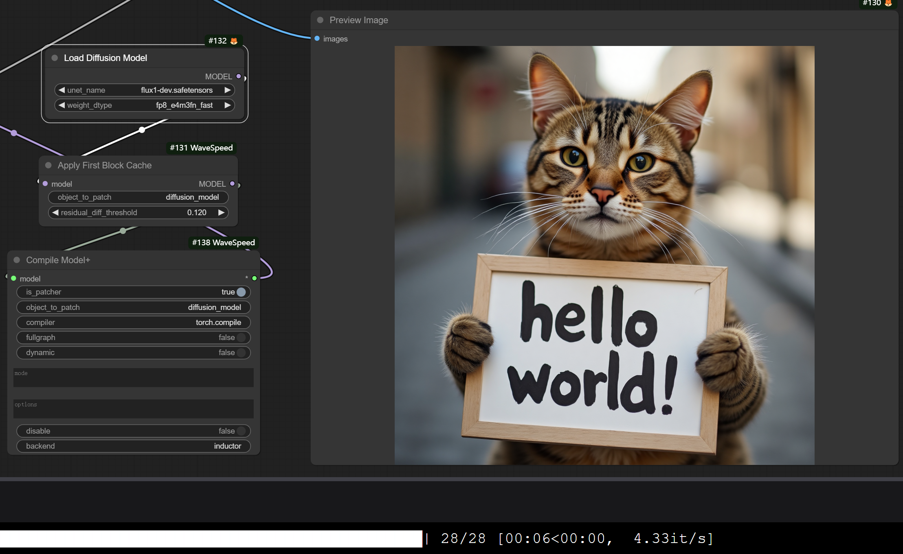
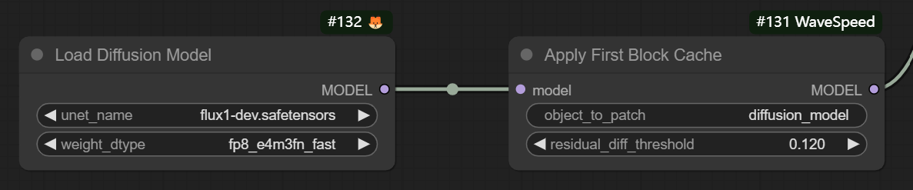

# Comfy-WaveSpeed

[WIP] The all in one inference optimization solution for ComfyUI, universal, flexible, and fast.

- [x] [Dynamic Caching (First Block Cache)](https://github.com/chengzeyi/ParaAttention?tab=readme-ov-file#first-block-cache-our-dynamic-caching)
- [x] Enhanced `torch.compile`

More to come...

- [ ] Multi-GPU Inference (ComfyUI version of [ParaAttention's Context Parallelism](https://github.com/chengzeyi/ParaAttention?tab=readme-ov-file#context-parallelism))

| FLUX.1-dev Original | FLUX.1-dev with First Block Cache and Compilation |
| - | - |
|  |  |

This is just launched, and we are working on it. Please stay tuned.
For any request or question, please join the Discord server.

[Discord Server](https://discord.gg/xtk6jUtYtr)

[Comfy Registry](https://registry.comfy.org/nodes/wavespeed)

# Installation

```bash
cd custom_nodes
git clone https://github.com/chengzeyi/Comfy-WaveSpeed.git
```

# Usage

## Demo Workflows

You can find demo workflows in the `workflows` folder.

| Workflow | Path |
| - | - |
| FLUX.1-dev with First Block Cache and Compilation | [workflows/flux.json](./workflows/flux.json)
| FLUX.1-dev ControlNet with First Block Cache and Compilation | [workflows/flux_controlnet.json](./workflows/flux_controlnet.json)
| LTXV with First Block Cache and Compilation | [workflows/ltxv.json](./workflows/ltxv.json)
| HunyuanVideo with First Block Cache | [workflows/hunyuan_video.json](./workflows/hunyuan_video.json)
| SD3.5 with First Block Cache and Compilation | [workflows/sd3.5.json](./workflows/sd3.5.json)
| SDXL with First Block Cache | [workflows/sdxl.json](./workflows/sdxl.json)

**NOTE**: The `Compile Model+` node requires your computation to meet some software and hardware requirements, please refer to the [Enhanced `torch.compile`](#enhanced-torchcompile) section for more information.
If you have problems with the compilation node, you can remove it from the workflow and only use the `Apply First Block Cache` node.
The `Apply First Block Cache` node can still bring you a significant speedup.

## Dynamic Caching ([First Block Cache](https://github.com/chengzeyi/ParaAttention?tab=readme-ov-file#first-block-cache-our-dynamic-caching))

Inspired by TeaCache and other denoising caching algorithms, we introduce [First Block Cache (FBCache)](https://github.com/chengzeyi/ParaAttention?tab=readme-ov-file#first-block-cache-our-dynamic-caching) to use the residual output of the first transformer block as the cache indicator.
If the difference between the current and the previous residual output of the first transformer block is small enough, we can reuse the previous final residual output and skip the computation of all the following transformer blocks.
This can significantly reduce the computation cost of the model, achieving a speedup of up to 2x while maintaining high accuracy.

To use first block cache, simply add the `wavespeed->Apply First Block Cache` node to your workflow after your `Load Diffusion Model` node and adjust the `residual_diff_threashold` value to a suitable value for your model, for example: `0.12` for `flux-dev.safetensors` with `fp8_e4m3fn_fast` and 28 steps.
It is expected to see a speedup of 1.5x to 3.0x with acceptable accuracy loss.

It supports many models like `FLUX`, `LTXV (native and non-native)`, `HunyuanVideo (native)`, `SD3.5` and `SDXL`, feel free to try it out and let us know if you have any issues!

Some configurations for different models that you can try:

| Model | Steps | `residual_diff_threashold` |
| - | - | - |
| `flux-dev.safetensors` with `fp8_e4m3fn_fast` | 28 | 0.12 |
| `ltx-video-2b-v0.9.1.safetensors` | 30 | 0.1 |
| `hunyuan_video_720_cfgdistill_fp8_e4m3fn.safetensors` | 20 | 0.1 |
| `sd3.5_large_fp8_scaled.safetensors` | 30 | 0.12 |
| `sd_xl_base_1.0.safetensors` | 25 | 0.2 |

See [Apply First Block Cache on FLUX.1-dev](https://github.com/chengzeyi/ParaAttention/blob/main/doc/fastest_flux.md#apply-first-block-cache-on-flux1-dev) for more information and detailed comparison on quality and speed.



## Enhanced `torch.compile`

To use the Enhanced `torch.compile`, simply add the `wavespeed->Compile Model+` node to your workflow after your `Load Diffusion Model` node or `Apply First Block Cache` node.
The compilation process happens the first time you run the workflow, and it takes quite a long time, but it will be cached for future runs.
You can pass different `mode` values to make it runs faster, for example `max-autotune` or `max-autotune-no-cudagraphs`.
One of the advantages of this node over the original `TorchCompileModel` node is that it works with LoRA.

It is suggested to pass `--gpu-only` when launching your `ComfyUI` if you are using this node, for example, if you are using `comfy-cli`:

```bash
comfy launch -- --gpu-only
```

If you encounter any problems with frequent compilation after changing the resolution or text prompt, you could try enabling the `dynamic` option of the `Compile Model+` node.
Or you could launch your `ComfyUI` with environment variable `TORCH_LOGS=recompiles_verbose` to debug the reason for recompilation.

**NOTE**: `torch.compile` might not be able to work with model offloading well, you could try passing `--gpu-only` when launching your `ComfyUI` to disable model offloading.

**NOTE**: `torch.compile` does not work on Windows offcially, you should not use this node if you are facing this problem, or search on Google to find out how to make it work.

**NOTE**: Compiling a model with FP8 quantization does not work on pre-Ada GPUs like RTX 3090, you should try using FP16/BF16 models or removing the compilation node.


# Others

## Use with `diffusers`

Please refer to [ParaAttention](https://github.com/chengzeyi/ParaAttention) for more information.
